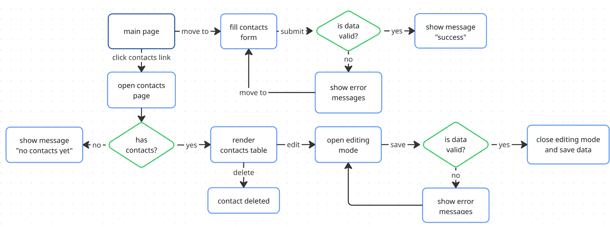

# Client-Server Demo: Contacts App

A pet web application with a form, a table, a REST API and a MySQL database. Hosted locally only.

## Table of Contents

- [Introduction](#introduction)
- [Background](#background)
- [Tools I Used](#tools-i-used)
- [Project Structure](#project-structure)
- [Getting Started](#getting-started)
- [Development](#development)
- [Testing](#testing)
- [Conclusions](#conclusions)

## Introduction

### What is this?

This is my pet web application that implements a basic client-server architecture (an HTML form submitted to a server) with a single REST resource. It is hosted locally only.

### What is it for?

The main purpose is to build my own testing sandbox where I can test input fields, buttons, client-side and server-side validation, database queries, and so on. Since I have the source code in front of me, I can also apply white-box testing techniques: read, understand, review and even modify the code myself.

### Is there any documentation?

1. [Requirements](test_docs/requirements.md)
2. [API Docs](test_docs/client-server-demo-api.md)
3. [Test Plan](test_docs/test_plan.md)
4. [Test Design, Test Runs and Bug Reports (Google Sheets)](https://docs.google.com/spreadsheets/d/1El2wjPAUodW4dijbkz-NU5M9AfLfp7HZYnebpSTQmz8/edit?usp=sharing)
5. [Postman collection (JSON)](test_docs/localhost.postman_collection.json)
6. [Automated GUI tests (separate repository)](https://github.com/sergey-fishman/client-server-demo_auto)

## Background

As a student QA, I wanted a better understanding of how web applications are structured and developed. I already knew the basics: HTML, CSS and JavaScript for the client-side user interface; server-side code for processing requests and running SQL queries; databases for storing data; and the HTTP protocol for communication between them. I had already worked with all of these, but only as a tester, using black-box testing.

So I made a bold attempt to develop my own application and, at the same time, to recreate the Software Testing Life Cycle (STLC) in miniature: starting with the requirements, moving on to the test plan, then elaborating the test design, running test cases (including automated ones) and writing bug reports.

## Tools I Used

1. **XAMPP Control Panel.** A great utility that starts the Apache web server and MySQL on a local machine.
2. **VS Code.** A universal code editor.
3. **Git and GitHub.** Version control and hosting of the project documentation.
4. **Claude.** Generating HTML, CSS, JavaScript and PHP code.
5. **Google Sheets.** Test documentation.
6. **Chrome DevTools.** Network monitoring, front-end debugging.
7. **Postman.** Building and running collections of API tests.
8. **Selenium WebDriver (Java), TestNG and Gradle.** Running automated GUI tests.

## Project Structure

```text
.
├── index.html            # Main page: the Contacts form
├── contacts.html         # Contacts page: the Contacts table
├── css/
│   └── styles.css
├── js/
│   ├── name-rules.js     # Regular expressions and validation rules
│   ├── validation.js     # Live validation of the form
│   ├── submit-handler.js # Sending the form to the server
│   └── contacts.js       # Loading, rendering, editing and deleting contacts
├── api/
│   ├── contacts.php      # The single REST resource (GET, POST, PUT, DELETE)
│   ├── helpers.php       # Validation and helper functions
│   └── db.php            # Database connection
├── test_docs/            # Requirements, API docs, test plan, Postman Collection
└── assets/               # Images used in this README
```

## Getting Started

1. Install XAMPP and start **Apache** and **MySQL** in the XAMPP Control Panel.
2. Copy the project folder to the `htdocs` directory of XAMPP.
3. Create the `testdb` database and the `contacts` table (see [First steps](#first-steps)).
4. Check the connection settings in [db.php](api/db.php). The defaults are the XAMPP ones: user `root`, empty password.
5. Open `http://localhost/<project-folder>/index.html` in a browser.

> **Note:** the default `root` user with an empty password is acceptable only for a local sandbox. Never deploy this configuration to a public server.

## Development

### Planning


*The flow chart. The top-left is the starting point.*

I began with the design. In general, I wanted a submit form with input fields and with client-side and server-side validation. I also decided to add a table that displays all created resources and allows editing and deleting them. These resources turned out to be Contacts with two attributes: full name and phone number. In the end, I decided to create two pages: the Main page with the Contacts form and the Contacts page with the Contacts table.

As for the server side, I wanted to implement a RESTful web API: JSON format and a single REST resource.

The first version of the application was built around a *users* entity (first name and last name) with a separate PHP file for each operation (submit, list, update, delete). Later I rebuilt it around the *contacts* entity and merged all operations into one endpoint, where the HTTP method decides what to do.

### First steps

I started by creating the database. In my case, it has only one table: `contacts`.

```sql
CREATE DATABASE IF NOT EXISTS testdb;
USE testdb;

CREATE TABLE contacts (
   id INT AUTO_INCREMENT PRIMARY KEY,
   full_name VARCHAR(60) NOT NULL,
   phone_number VARCHAR(16) NOT NULL,
   created_at TIMESTAMP DEFAULT CURRENT_TIMESTAMP
);
```
*MySQL query*

The next step was to build the Contacts form. I asked Claude to help me generate it, and our joint effort produced the result below.

```html
<div class="container">
    <h2>Input your Full name and phone number</h2>
    <form id="contactForm">
        <div class="field-wrapper">
            <input type="text" id="fullName" placeholder="Alexander-Arnold O'Connor">
            <div class="popup" id="fullNamePopup"></div>
        </div>
        <div class="field-wrapper">
            <input type="tel" id="phoneNumber" placeholder="+14155552671">
            <div class="popup" id="phoneNumberPopup"></div>
        </div>
        <button type="submit" id="submitBtn">Submit</button>
    </form>
    <p id="result"></p>
</div>
```
*Sample from index.html*

### JavaScript (client side)

This section covers the JavaScript files of the project and describes what each of them does.

Following the clean-code principle, I wanted every part of the application to live in a separate file.

**[name-rules.js](js/name-rules.js)** contains the regular expressions and the validation functions shared by the form and the Contacts table. For the full name I wanted a sophisticated regular expression: 2-60 characters, Unicode letters, and at most one special symbol (space, hyphen or apostrophe) between letters. For the phone number I came up with a simpler solution: it starts with `+`, followed by one digit (1-9), followed by 6 to 14 digits (7-15 digits in total, no spaces). The same patterns are duplicated on the server side in `helpers.php`, so they must always be kept in sync.

```javascript
const NAME_REGEX = /^(?=.{2,60}$)\p{L}+(?:[ '\u{2019}-]\p{L}+)*$/u;
const PHONE_REGEX = /^\+[1-9]\d{6,14}$/;
```
*Sample from name-rules.js*

**[validation.js](js/validation.js)** validates each field of the form while the user is typing. The border color changes to green or red immediately. The error popup appears after a failed submit attempt and is hidden as soon as the input becomes valid.

```javascript
fullNameInput.addEventListener("input", () => {
    const error = updateBorder(fullNameInput, validateFullName);
    if (!error) {
        hidePopup(fullNamePopup);
    } else if (fullNamePopup.classList.contains("show")) {
        showPopup(fullNamePopup, error);
    }
});
```
*Sample from validation.js. Live input update: the border color changes, and the popup is hidden as soon as the input is valid.*

**[submit-handler.js](js/submit-handler.js)** is responsible for the submit logic:
1. checking once more that the form is valid before sending it to the server;
2. converting the JavaScript object to a JSON string (serialization), sending it to the server with a `POST` request and displaying the response.

```javascript
const data = {
    full_name: document.getElementById("fullName").value,
    phone_number: document.getElementById("phoneNumber").value
};

const response = await fetch("api/contacts.php", {
    method: "POST",
    headers: { "Content-Type": "application/json" },
    body: JSON.stringify(data)
});
```
*Sample from submit-handler.js. Sending JSON to the server.*

**[contacts.js](js/contacts.js)** is responsible for loading and rendering the Contacts table, as well as for editing and deleting rows. It uses event delegation: a single listener on the table body handles the Edit, Cancel, Save and Delete buttons, and the keyboard as well (Enter saves a row, Escape cancels editing).

```javascript
async function loadContacts() {
    try {
        const result = await apiRequest(CONTACTS_URL);
        contactsById = {};
        result.contacts.forEach(function (contact) {
            contactsById[contact.id] = contact;
        });
        renderContacts(result.contacts);
        table.style.display = "";
        return true;
    } catch (err) {
        table.style.display = "none";
        showMessage(err.message, "error");
        return false;
    }
}
```
*Sample from contacts.js. The function that loads the table.*

A row can be edited and deleted directly in the table. While a row is being edited, its fields are validated live, using the same border logic as on the form page.

```javascript
tableBody.addEventListener("input", function (e) {
    if (e.target.matches("input[name]")) {
        markInput(e.target, validatorFor(e.target)(e.target.value));
    }
});
```
*Sample from contacts.js. Live validation while typing.*

### Server side (PHP)

**[helpers.php](api/helpers.php)** contains the helper functions of the API:
- Content-Type validation, reading and parsing the request body;
- validation of `full_name` and `phone_number` from the request body: missing fields check, string data type check and regular expression compliance;
- reading and validating the contact id from the query string (`?id=5`).

As a QA engineer, I find it crucial to think through every scenario I can imagine and to make the program return clear, self-explanatory responses, especially on errors.

```php
function readJsonObject(): object {
    $contentType = $_SERVER["CONTENT_TYPE"] ?? "";
    if (stripos($contentType, "application/json") === false) {
        sendJson(415, ["error" => "Content-Type must be application/json"]);
    }

    $rawInput = file_get_contents("php://input");
    $data = json_decode($rawInput);

    if ($data === null && json_last_error() !== JSON_ERROR_NONE) {
        sendJson(400, ["error" => "Invalid JSON object"]);
    }

    if (!is_object($data)) {
        sendJson(422, ["error" => "JSON body must be an object"]);
    }

    return $data;
}
```
*Sample from helpers.php. The function returns the decoded JSON object (stdClass) or stops with an error.*

**[db.php](api/db.php)** provides the connection to the MySQL database:

```php
$conn = new mysqli($host, $user, $password, $dbname);
```

And last but not least, **[contacts.php](api/contacts.php)**. This file implements the desired RESTful single-resource architecture: the request method decides which operation is performed.

|Method|Request|Body|Operation|
|---|---|---|---|
|`GET`|`api/contacts.php`|none|Load the list of all contacts|
|`POST`|`api/contacts.php`|`{"full_name","phone_number"}`|Create a contact|
|`PUT`|`api/contacts.php?id=N`|`{"full_name","phone_number"}`| Update a contact|
|`DELETE`|`api/contacts.php?id=N`|none|Delete a contact|

Each method has its own function (`handleGet`, `handlePost`, `handlePut`, `handleDelete`) that builds and runs the database query. Every query that uses input data (create, update, delete and the existence check) is a prepared statement, which protects against SQL injection.

One detail worth noting in `handlePut`: MySQL reports 0 affected rows not only when the id does not exist, but also when the new values are identical to the old ones. That is why the function checks separately that the row exists before returning `404`.

```php
function handlePut(mysqli $conn): void {
    $id = getIdFromQuery();
    $data = readJsonObject();
    [$fullName, $phoneNumber] = validateContactPayload($data);

    $stmt = $conn->prepare("UPDATE contacts SET full_name = ?, phone_number = ? WHERE id = ?");
    $stmt->bind_param("ssi", $fullName, $phoneNumber, $id);

    if (!$stmt->execute()) {
        $stmt->close();
        $conn->close();
        sendJson(500, ["error" => "Error updating DB"]);
    }

    $affectedRows = $stmt->affected_rows;
    $stmt->close();

    if ($affectedRows === 0 && !contactExists($conn, $id)) {
        $conn->close();
        sendJson(404, ["error" => "Contact not found"]);
    }

    $conn->close();
    sendJson(200, [
        "status" => "success",
        "id" => $id,
        "full_name" => $fullName,
        "phone_number" => $phoneNumber
    ]);
}
```
*Sample from contacts.php. Handling of PUT requests.*

#### HTTP status codes used by the API

| Code | Meaning in this API |
|------|---------------------|
| 200  | Successful `GET`, `PUT` or `DELETE` |
| 201  | Contact created (`POST`) |
| 400  | Invalid JSON |
| 404  | Contact not found (`PUT`, `DELETE`) |
| 405  | HTTP method is not supported |
| 415  | `Content-Type` is not `application/json` |
| 422  | Validation error: JSON body is not an object, missing field, wrong data type, invalid name or phone number, invalid `id` |
| 500  | Database error |

## Testing

Development is only one half of the story; the other half is testing. In this section I describe the Software Testing Life Cycle (STLC) of my application: from the requirements analysis to the test execution and the bug reports.

### Requirements Analysis

As far as I have learned, it is considered good practice to start testing as early as possible, following the *shift-left* approach. A requirements review is one of the most important steps. It is a form of **static testing** (testing without running the code) that makes it possible to find defects in the future product and fix them before they are implemented in code, thus saving time and resources.

The **[Requirements](test_docs/requirements.md)** are written as numbered requirements (`REQ-x-y`) and user stories with acceptance criteria (`US-n:AC-m`). The numbering is what makes **traceability** possible. I reviewed the requirements against the following quality criteria:

- **Completeness:** nothing essential is missing.
- **Consistency:** the requirements do not contradict each other.
- **Unambiguity and clarity:** a requirement can be interpreted in only one way.
- **Traceability:** every requirement has an ID and can be linked to test cases.
- **Feasibility:** the requirement can be implemented within the project's constraints.
- **Verifiability (testability):** there is an objective way to check the requirement.

Since I am the only person on the project, this was an individual review (a desk check). In a real project, I would use a walkthrough or a technical review together with developers, a business analyst and a product owner.

### Test Planning

**[The Test Plan](test_docs/test_plan.md)** defines the scope, approach, criteria, schedule, resources, environment, risks and deliverables.

1. **Scope.** I decided to concentrate on **functional testing**, because the application has only a few features. I also added several types of **non-functional testing**: usability testing and UI layout testing, for example checking the behavior of the table at different screen resolutions. Cross-browser testing is limited to the automated smoke tests (Chrome, Firefox and Edge). Out of scope: mobile compatibility, performance, accessibility and security testing (except for basic input validation checks).
2. **Approach.** The main approach is **black-box testing**; **white-box** techniques (code review) are used as an addition. The client-server architecture implies **integration testing** (client, server and database), which is included among the test levels together with end-to-end **system testing**. Tests are both manual and automated: the checklist is run manually, while the GUI test cases are automated.
3. **Entry and exit criteria.** *Entry:* the requirements are defined and approved, and the test cases are ready. *Exit:* there are no open critical defects.
4. **Schedule and resources.** The project is a sandbox without a strict schedule. Testing is performed by one tester (myself).
5. **Environment.** The application is tested on a local XAMPP stack (Apache, PHP, MySQL) in the desktop Chrome browser (version 151) on Windows 11 with a 1920x1080 screen; the automated smoke tests also run in Firefox and Edge. Google Sheets serves as both the test management system and the bug tracker, because it is a convenient and lightweight choice for a project of this size. Postman is used for API testing, Chrome DevTools for network monitoring, and Selenium WebDriver (Java) for automation.
6. **Risks and deliverables.**
   - *Risks:* a single tester (no independent review); development and testing share the same local database, so the test data can affect the results; the validation rules are duplicated in JavaScript and PHP and can diverge; the full set of tests is run in one browser only, while Firefox and Edge are covered by the smoke tests.
   - *Deliverables:* the requirements, the test plan, the checklist, the test cases with test data, the test run log, the bug reports, the Postman collection and the automated tests.

### Test Case Development

Test case development means designing manual and automated tests that cover the requirements (the **test basis**). Exhaustive testing is impossible, so I use test design techniques to choose a small but effective set of tests. In my project, the test cases for automated testing are written separately, and the manual tests are documented as **checklists**. A checklist is a lightweight list of what has to be verified, without detailed steps. A test case, in contrast, contains preconditions, steps, test data and an expected result.

#### Checklists

The checklist is on the *checklist* tab of the [Google Sheets document](https://docs.google.com/spreadsheets/d/1El2wjPAUodW4dijbkz-NU5M9AfLfp7HZYnebpSTQmz8/edit?usp=sharing). Each item has an ID (`CL-nn`), a module, a submodule, an element or function, a summary, a status, a reference to a requirement or user story (`REQ/US`) and the date of the run.

The checklist covers UI tests, including both positive and negative scenarios. Most items are based on the requirements, which gives **requirements traceability**. Some items are based on the tester's (my own) knowledge and common sense instead: these are **experience-based techniques**, namely **error guessing** and **exploratory testing**. I explored the application first and wrote the checklist items based on the results. Such items have `N/A (UI/non-functional)` in the requirement column, for example CL-02 (text must not extend beyond the field boundaries) and CL-21 (double click on "Submit" must not create a duplicate contact). In a real project, before adding such an item to the testing documentation, it must be discussed with the product owner and stakeholders, and the requirements must be updated.

#### Test Cases and Test Data

The test cases are on the *test cases* tab of the same [Google Sheets document](https://docs.google.com/spreadsheets/d/1El2wjPAUodW4dijbkz-NU5M9AfLfp7HZYnebpSTQmz8/edit?usp=sharing) and focus on functional testing. Because the input fields have specific requirements, I first defined the **test data** and then built the test cases around it.

For the test data I used **Equivalence Partitioning (EP)** and **Boundary Value Analysis (BVA)**. I divided the test data into valid (positive) and invalid (negative), and assigned a category to each item (for example, string length, Unicode letters, supported symbols), so it is clear which condition is being tested. For example, the full name must be 2-60 characters long, so the boundary values are 1, 2, 3 and 59, 60, 61 characters. The phone number must contain 7-15 digits, so the boundary values are 6, 7, 8 and 14, 15, 16 digits.

Test design techniques used in the project:

| Technique | Group | Where it is used |
|---|---|---|
| Equivalence Partitioning | Black-box | Test data for the full name and the phone number |
| Boundary Value Analysis | Black-box | Length limits of the input fields |
| Requirements-based testing (`REQ`, `US:AC`) | Black-box | Checklist and test cases |
| Checklist-based testing | Experience-based | UI checklist |
| Error guessing | Experience-based | Items without a requirement, e.g. CL-21 |
| Exploratory testing | Experience-based | Preparing the checklist |
| Static testing (reviews) | Static | Requirements review, code review |

### Test Automation

The automated GUI tests of the form and the table are written in Java with **Selenium WebDriver** and live in a [separate repository](https://github.com/sergey-fishman/client-server-demo_auto). The project uses **TestNG** as the test framework and **Gradle** as the build tool.

- **Coverage.** All GUI test cases are automated. The checklist is run manually.
- **Data-driven testing.** For the test cases that use test data, I designed and implemented a TestNG Data Provider class.
- **Smoke tests.** I developed a group of smoke tests that can be run with Gradle tasks in different browsers (**cross-browser testing**: Chrome, Firefox and Edge).
- **Logging.** A TestNG listener combined with a logger makes it easy to track and log test runs.
- **API tests.** Automated API tests are planned. For now, the API is covered by the Postman collection described below.

### API Testing

For API testing, I created a **Postman collection** ([exported JSON](test_docs/localhost.postman_collection.json)). I divided the collection into three groups:

- **Positive (happy) path.** The main features used normally and with valid data: getting the contact list, creating a contact, updating a contact, deleting a contact, and updating a contact with the same data as before (the case of 0 affected rows, see the note on `handlePut` above).
- **Destructive path.** Incorrect client behavior (misuse of the API): a request method that is not allowed, an invalid `Content-Type`, a broken or incomplete JSON object, a missing `id` parameter and so on.
- **Negative data validation path.** Server-side input validation. At the moment, it covers only contact creation (`POST`); contact update (`PUT`) is planned.

### Test Execution

The checklist was run on build 1.0 on 29-30 September 2026 (Windows 11, Chrome 151, 1920x1080). At the time of writing, 39 checklist items have been run: 38 passed and 1 failed (CL-21). The results of the test cases are recorded on the *test cases run log* tab. Every failed item results in a bug report.

### Bug Reports

Bug reports are kept on the *bug reports* tab of the same Google Sheets document. A report contains: ID, title, build, environment, steps to reproduce, expected result, actual result, **severity** (how badly the defect affects the system), **priority** (how urgently it must be fixed), status, attachments (screenshot, response body) and a link to the failed checklist item or test case.

The statuses follow a standard defect life cycle: New, In progress, Fixed, Retest, Closed (or Reopened if the fix does not work, or Rejected / Duplicate).

Example, based on the failed item CL-21:

| Field | Value |
|---|---|
| Title | Double click on "Submit" creates a duplicate contact |
| Found in | Build 1.0, Windows 11, Chrome 151, 1920x1080 |
| Steps to reproduce | 1. Open the Main page. 2. Enter a valid full name and a valid phone number. 3. Double-click "Submit". 4. Open the Contacts page. |
| Expected result | One new contact is created |
| Actual result | Two identical contacts are created |
| Severity / Priority | Minor / Medium |
| Status | New |

## Conclusions

Building this application let me look at web development from the other side of the screen, and it gave me a lot of practical material for testing.

- **Client-side and server-side validation solve different problems.** Client-side validation gives the user instant feedback, while server-side validation is the real line of defense, because a request can always bypass the UI and be sent by any HTTP client.
- **Duplicated rules must be kept in sync.** The validation patterns exist in both JavaScript and PHP. Any change has to be made in both places and re-tested, which is a good source of test cases in itself.
- **A single REST resource keeps the API compact and predictable.** Merging separate files for each operation into one endpoint, where the HTTP method decides the operation, made the code simpler and the API easier to document and test.
- **Clear status codes and error messages make testing easier.** Precise responses (400, 404, 415, 422 and so on) make it obvious what went wrong, and make bug reports more accurate.
- **White-box access changes the way of testing.** Seeing the code behind the behavior, for example the affected-rows nuance in `PUT`, helps to design test cases that would be hard to think of using the black-box approach only.
- **Experience-based testing complements requirements-based testing.** The only failed checklist item (double click on "Submit", CL-21) is not derived from any requirement: it came from common sense and exploration.
- **Exhaustive testing is impossible, so test design techniques matter.** Equivalence Partitioning and Boundary Value Analysis let me cover the input rules with a small set of test data.

### Known limitations and ideas for the future

- There is no authentication, and the database is accessed as `root` without a password, so the application is for local use only.
- `submit-handler.js` does not handle network errors and shows the raw JSON response to the user.
- The contacts list has no pagination or search.
- Testing was performed by one tester, so there is no independent review. The full set of tests is run in desktop Chrome only; other browsers are covered by the smoke tests.
- Automated API tests and negative data validation tests for the `PUT` request are not implemented yet.
- Ideas for the test design: add decision table tests (valid/invalid name and phone combinations on submit) and state transition tests (view, edit, save, cancel and delete in the Contacts table).
